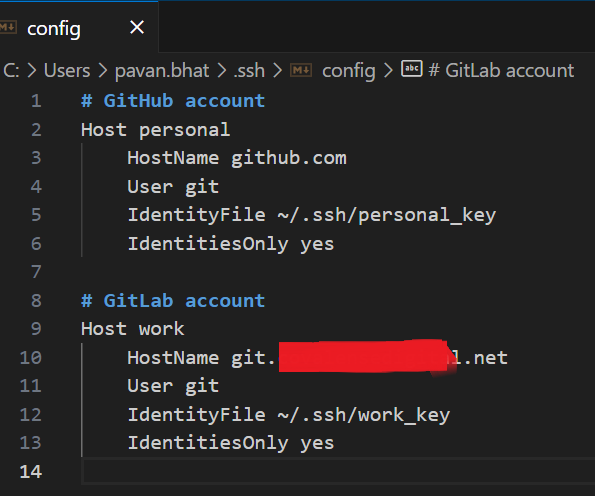
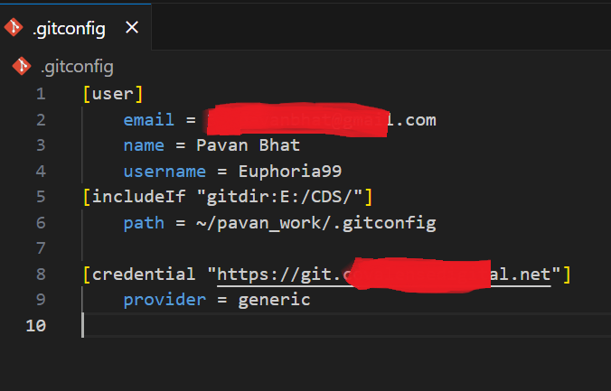
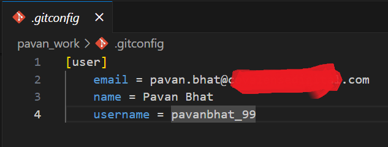

# Adding Multiple GitHub Accounts

## Step 1: Generate SSH Keys

Navigate to the `.ssh` folder and generate SSH keys for all your GitHub/GitLab accounts.

```bash
cd ~/.ssh
```

### Save as id_rsa_personal
```
ssh-keygen -t rsa -b 4096 -C "personal_email_id"
```

### Save as id_rsa_work

```
ssh-keygen -t rsa -b 4096 -C "work_email_id"
```

## Step 2: Add SSH Keys to GitHub/GitLab

Copy `id_rsa_personal.pub` and `id_rsa_work.pub` and add them to the respective GitHub/GitLab accounts.

## Step 3: Create SSH Config File

Create a config file in the `.ssh` folder and add the following configurations:

```bash
touch config
```

### Add the config

```plaintext
Host personal
   HostName github.com
   User git
   IdentityFile ~/.ssh/id_rsa_personal
   IdentitiesOnly yes

Host work
   HostName github.com # or gitlab.com
   User git
   IdentityFile ~/.ssh/id_rsa_work
   IdentitiesOnly yes
```

> **Note:** Your company might have its own domain like `git.company-name.net`; make sure to mention it accordingly.




## Step 4: Create Git Configurations

Create `.gitconfig` for personal and work directories with the respective Git host names.

```bash
cd ~
```

```
nano ~/.gitconfig
```

```plaintext
[user]
    name = personal_name
    email = personal_email_id
[includeIf "gitdir:~/work/"]
    path = ~/work/.gitconfig
```



```bash
$ nano ~/work/.gitconfig
```

```plaintext
[user]
    name = your_name
    email = work_email_id
    username = user_name
```



## Step 5: Add New SSH Keys

Add the newly created SSH keys.

```bash
cd ~/.ssh
```
```
ssh-add id_rsa_personal
```
```
ssh-add id_rsa_work
```
```
ssh-add -l
```

## Step 6: Test Configuration

Check if the configuration is correct by pinging GitHub.

```
ssh -T personal
```
```
ssh -T work
```

## Step 7: Clone Repositories

Always clone repositories by adding the hostname in the remote URL.

```bash
git clone git@personal:something/something.github.io.git
git clone git@work:something/something.github.io.git
```

## To Delete All the Keys 

```
ssh-add -D
```


<a href="https://www.youtube.com/watch?v=lLgWWtOk7gk" target="_blank">Video Reference</a>